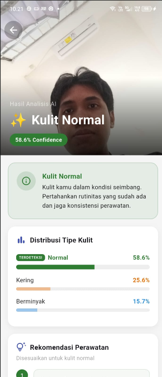
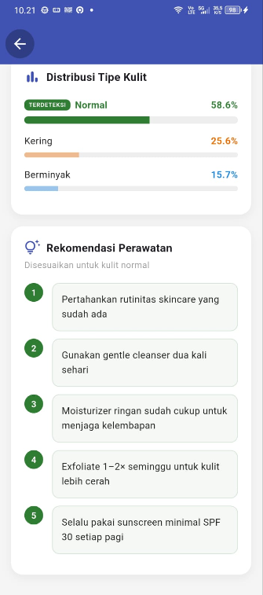

# Skincare Stack AI

Aplikasi Flutter untuk analisis jenis kulit wajah menggunakan AI yang berjalan langsung di perangkat (Edge AI / On-Device ML).

**Nama :** Rayhan Aurelia Pramana Rijal
**NRP :** 5025231237

---

## Fitur AI — Untuk Apa?

Mengklasifikasikan jenis kulit wajah ke dalam 3 kategori:
- **Oily** — Kulit Berminyak
- **Dry** — Kulit Kering
- **Normal** — Kulit Normal

Output yang diberikan:
- Jenis kulit + confidence score
- Probabilitas ketiga kelas
- Deskripsi kondisi kulit
- 5 rekomendasi produk skincare

---

## Cara Kerja AI

```
Foto Wajah
    ↓
Preprocessing: resize 224×224, normalisasi piksel [0–1]
    ↓
TFLite Interpreter (on-device, tanpa internet)
    ↓
Output probabilitas → kelas dengan nilai tertinggi = hasil
    ↓
Tampilkan hasil + rekomendasi
```

**Model:** MobileNetV2 (pre-trained ImageNet) + custom classification head
**Format:** TensorFlow Lite, Float16 Quantization
**Input:** Tensor `[1, 224, 224, 3]`
**Output:** Tensor `[1, 3]` — probabilitas tiap kelas

---

## Cara Menggunakan

1. Buka menu **Skin Journal**
2. Buat entri baru → lampirkan foto wajah
3. Tap tombol **"Analisis AI"**
4. Tunggu hasil (< 2 detik)
5. Lihat jenis kulit, confidence, dan rekomendasi

**Tips foto terbaik:** pencahayaan merata, arah frontal, tanpa makeup, kulit bersih.

---

## Kenapa Edge Computing?

| | |
|---|---|
| **Privasi** | Foto tidak pernah dikirim ke server |
| **Offline** | Tidak butuh koneksi internet |
| **Cepat** | Hasil instan tanpa round-trip jaringan |

---

## Teknologi

- Flutter `^3.11.1`
- TensorFlow Lite (`tflite_flutter: 0.10.1`)
- MobileNetV2 + Float16 Quantization
- Firebase Auth & Firestore
- Google Colab (training model)

---

## Menjalankan Aplikasi

```bash
git clone https://github.com/RayhanAurelia/Skincare-Stack-AI.git
cd Skincare-Stack-AI
flutter pub get
flutter run
```
#### Output




> Dokumentasi teknis lengkap: [docs/AI_SKIN_CLASSIFIER.md](docs/AI_SKIN_CLASSIFIER.md)